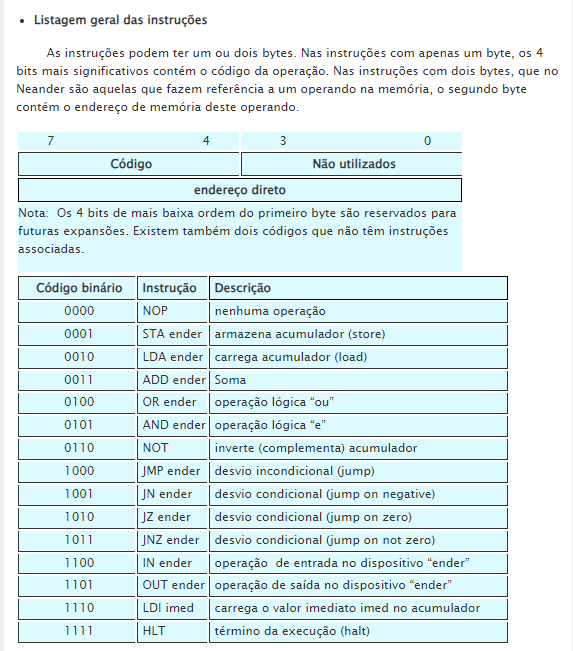

# Exemplos Básicos em NEANDER
- Este repositório contém exemplos básicos de código "Neander Assembly" que utiliza mnemônicos para realizar operações na máquina NEANDER.
- Os exemplos são projetados para ajudar a entender a sintaxe e a lógica da linguagem Neander.

## O que é NEANDER
- "Neander assembly" é uma linguagem didática que conta com algumas operações para um processador simples.
- NEANDER foi projetado para ensinar os fundamentos de arquitetura de computadores.

### Instruções Disponíveis

## Para saber mais sobre a máquina NEANDER:
- Acesse o site: [NEANDER - UFRJ](https://www.dcc.ufrj.br/~gabriel/neander.php)
